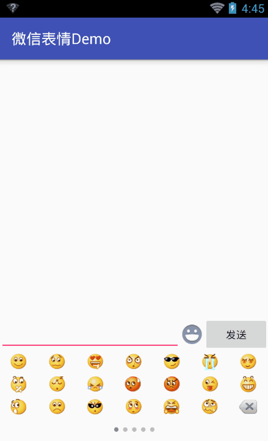

# 微信表情Demo

本工程模仿QQ/微信的表情输入，主要使用SpannableStringBuilder实现表情与文字同框。

下载apk体验一下：[app-debug.apk](app-debug.apk "点我下载")

以下贴出输入框文本 转 表情+文字 工具代码，具体细节请看Demo：

	/**
	 * @创建者 CSDN_LQR
	 * @描述 表情转换
	 */
	public class EmoParser {

    /**
     * 对文本中的表情符号转换成对应的表情
     *
     * @param context
     * @param content
     * @return
     */
    public static SpannableStringBuilder parseContent(Context context, String content) {

        SpannableStringBuilder ssb = new SpannableStringBuilder();

        //content ==> [smiley_00]hehe[smiley_12]...
        Pattern pattern = Pattern.compile("\\[smiley_(.*?)\\]");
        Matcher matcher = pattern.matcher(content);
        while (matcher.find()) {
            //[smiley_00]
            String group = matcher.group();

            //如果当前表情的前面有文字内容，则先将文字内容添加到ssb
            int indexOfGroup = content.indexOf(group);
            if (indexOfGroup > 0) {
                ssb.append(content.substring(0, indexOfGroup));
            }
            //修改原文本内容
            content = content.substring(indexOfGroup + group.length(), content.length());

            //smiley_00
            String emoName = group.substring(1, group.length() - 1);
            //得到类型是drawable的资源id
            int drawableId = context.getResources().getIdentifier(emoName, "mipmap", context.getPackageName());

            //得到图片并设置大小
            int emoSize = (int) (25 * context.getResources().getDisplayMetrics().density);
            Drawable drawable = context.getResources().getDrawable(drawableId);
            drawable.setBounds(0, 0, emoSize, emoSize);
            ImageSpan is = new ImageSpan(drawable);
            //创建图文混排对象
            SpannableString ss = new SpannableString(group);
            //对文字进行图片替换
            ss.setSpan(is, 0, group.length(), Spanned.SPAN_EXCLUSIVE_EXCLUSIVE);

            ssb.append(ss);
        }

        if (content.length() > 0) {
            ssb.append(content);
        }

        return ssb;
    }
}

效果如下：

